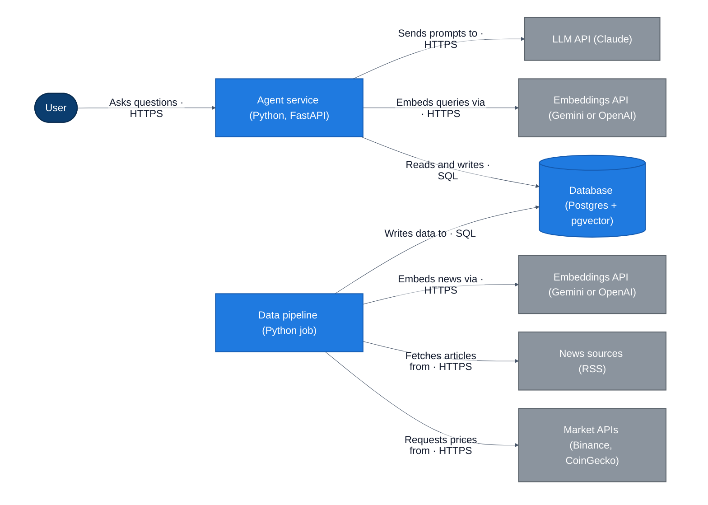
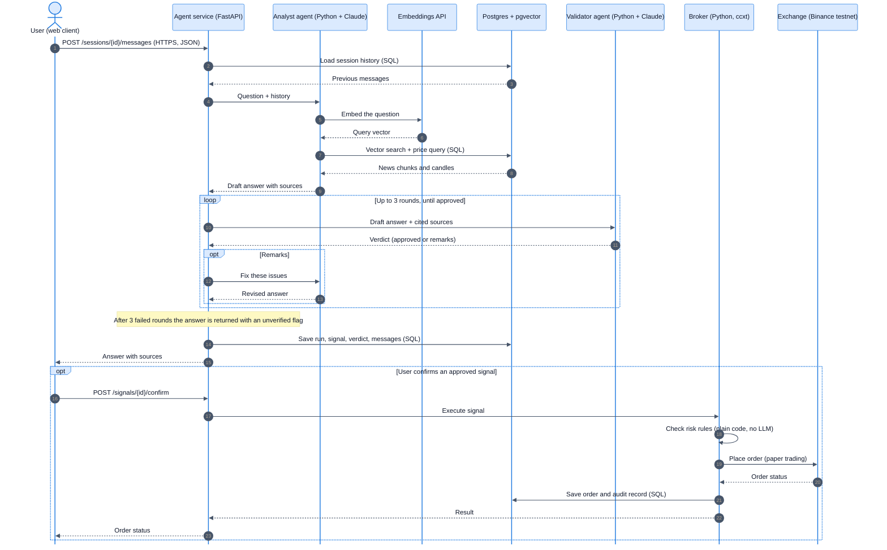

# Agentic System For Trading

## [Container Diagram](./docs/container-diagram.mmd)

```mermaid
%%{init: {"theme": "base", "themeVariables": {"fontFamily": "Inter, Segoe UI, Roboto, Arial, sans-serif", "fontSize": "22px", "textColor": "#0f172a", "lineColor": "#475569", "edgeLabelBackground": "#ffffff", "primaryTextColor": "#0f172a"}, "flowchart": {"curve": "basis", "nodeSpacing": 40, "rankSpacing": 110, "padding": 30, "htmlLabels": false}}}%%
flowchart LR
    subgraph canvas [" "]
        direction LR
        user(["User"])
        agents["Agent service (Python, FastAPI)"]
        ingest["Data pipeline (Python job)"]
        llm["LLM API (Claude)"]
        embA["Embeddings API (Gemini or OpenAI)"]
        db[("Database (Postgres + pgvector)")]
        embI["Embeddings API (Gemini or OpenAI)"]
        news["News sources (RSS)"]
        exchange["Market APIs (Binance, CoinGecko)"]

        user -->|"Asks questions · HTTPS"| agents
        agents -->|"Sends prompts to · HTTPS"| llm
        agents -->|"Embeds queries via · HTTPS"| embA
        agents -->|"Reads and writes · SQL"| db
        ingest -->|"Writes data to · SQL"| db
        ingest -->|"Embeds news via · HTTPS"| embI
        ingest -->|"Fetches articles from · HTTPS"| news
        ingest -->|"Requests prices from · HTTPS"| exchange
    end

    classDef person fill:#0b3d6f,stroke:#082a4d,color:#ffffff,stroke-width:2px
    classDef container fill:#1f7ae0,stroke:#145ab0,color:#ffffff,stroke-width:2px
    classDef external fill:#8b949e,stroke:#5b636b,color:#ffffff,stroke-width:2px
    class user person
    class agents,ingest,db container
    class llm,embA,embI,news,exchange external
    style canvas fill:#ffffff,stroke:#ffffff
```

## [Sequence Diagram](./docs/sequence-diagram.mmd)

```mermaid
%%{init: {"theme": "base", "themeVariables": {"fontFamily": "Inter, Segoe UI, Roboto, Arial, sans-serif", "fontSize": "16px", "textColor": "#0f172a", "lineColor": "#475569", "primaryTextColor": "#0f172a", "primaryColor": "#dbeafe", "primaryBorderColor": "#1f7ae0", "noteBkgColor": "#fef9c3", "noteTextColor": "#0f172a", "actorBkg": "#dbeafe", "actorBorder": "#1f7ae0", "actorTextColor": "#0f172a", "signalColor": "#475569", "signalTextColor": "#0f172a"}, "sequence": {"mirrorActors": false, "messageMargin": 40, "boxMargin": 10, "width": 170}}}%%
sequenceDiagram
    autonumber
    actor U as User (web client)
    participant API as Agent service (FastAPI)
    participant AN as Analyst agent (Python + Claude)
    participant EM as Embeddings API
    participant DB as Postgres + pgvector
    participant VA as Validator agent (Python + Claude)
    participant BR as Broker (Python, ccxt)
    participant EX as Exchange (Binance testnet)

    U->>API: POST /sessions/{id}/messages (HTTPS, JSON)
    API->>DB: Load session history (SQL)
    DB-->>API: Previous messages
    API->>AN: Question + history
    AN->>EM: Embed the question
    EM-->>AN: Query vector
    AN->>DB: Vector search + price query (SQL)
    DB-->>AN: News chunks and candles
    AN-->>API: Draft answer with sources

    loop Up to 3 rounds, until approved
        API->>VA: Draft answer + cited sources
        VA-->>API: Verdict (approved or remarks)
        opt Remarks
            API->>AN: Fix these issues
            AN-->>API: Revised answer
        end
    end

    Note over API: After 3 failed rounds the answer is returned with an unverified flag
    API->>DB: Save run, signal, verdict, messages (SQL)
    API-->>U: Answer with sources

    opt User confirms an approved signal
        U->>API: POST /signals/{id}/confirm
        API->>BR: Execute signal
        BR->>BR: Check risk rules (plain code, no LLM)
        BR->>EX: Place order (paper trading)
        EX-->>BR: Order status
        BR->>DB: Save order and audit record (SQL)
        BR-->>API: Result
        API-->>U: Order status
    end
```